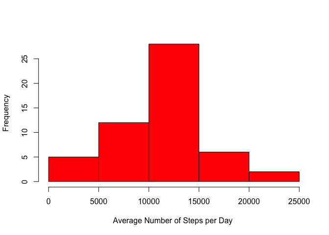
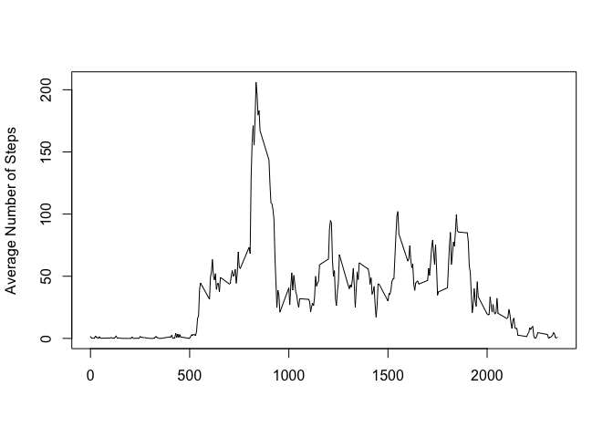
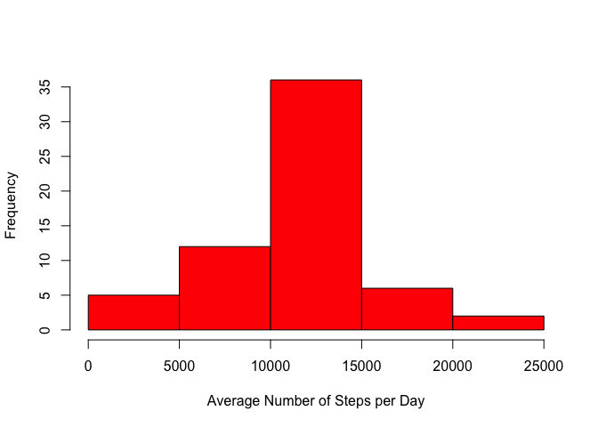
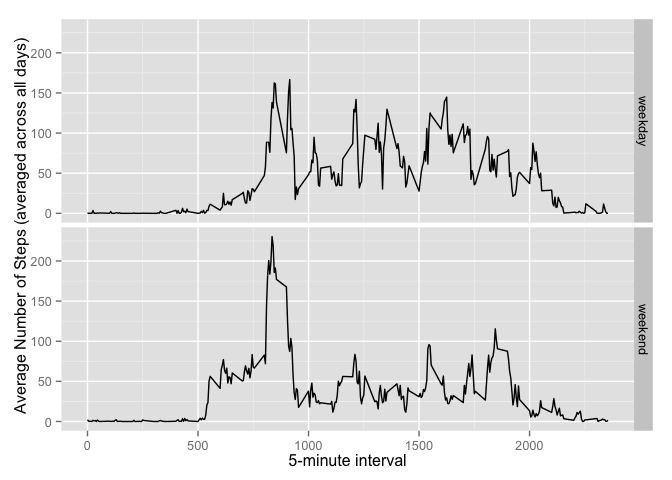

# Reproducible Research: Peer Assessment 1


## Loading and preprocessing the data
###1. Load activity.csv using read.csv()
###2. Separate complete and incomplete data. They will both be used in subsequent analysis.
###3. Delete the csv afterwards so it will not be included in the committed files.

```r
#unzip activity data
unzip("activity.zip")
#read activity csv
activityDF <- read.csv("activity.csv")

#load complete and incomplete dataset
completeActivityDF <- activityDF[complete.cases(activityDF),]
incompleteActivityDF <- activityDF[!complete.cases(activityDF),]

#delete csv
unlink("activity.csv")
```
  

## What is mean total number of steps taken per day?
###1. Make a histogram of the total number of steps taken each day

```r
#Get sum of steps per day
completeActivityDF1 <- completeActivityDF %>% 
  #select steps, date
  select(steps,date) %>% 
  # Group by date
  group_by(date) %>% 
  # Get the sum of each variables
  summarise_each(funs(sum)) 

#1. Make a histogram of the total number of steps taken each day
hist(as.numeric(completeActivityDF1$steps),main="", col="red",xlab="Average Number of Steps per Day ")
```

 


###2. Calculate and report the mean and median total number of steps taken per day

```r
medianVal <- as.integer(median(completeActivityDF1$steps))
meanVal <- as.integer(mean(completeActivityDF1$steps))
```
####The median value is 10765.
####The mean value is 10766.
  
## What is the average daily activity pattern?

```r
#Get average number of stepds per interval
completeActivityDF2 <- completeActivityDF %>% 
  #select steps, interval
  select(steps,interval) %>% 
  # Group by interval
  group_by(interval) %>% 
  # Get the mean 
  summarise_each(funs(mean)) %>% 
  # Sort result by interval
  arrange(interval)

plot(completeActivityDF2$interval,as.numeric(completeActivityDF2$steps),type="l", col="black", xlab="5-minute interval",ylab="Average Number of Steps (averaged across all days)")
```

 

```r
#interval with max ave steps

intervalWithMaxStep <- filter(completeActivityDF2,steps == max(completeActivityDF2$steps))
intervalWithMaxStep <- intervalWithMaxStep$interval
```
####The 5-minute interval that contains average maximum number of steps is 835.
  
## Imputing missing values
####There are 2304 rows with missing data in the activity dataset.
####The missing values are filled by substituting them with the mean value for the matching 5-minute interval.

```r
#Substitute the NA step value with the mean value of the step for the given interval
imputedActivityDF <- merge(incompleteActivityDF,completeActivityDF2,by.x = "interval",by.y="interval", all.x = TRUE)
imputedActivityDF <- select(imputedActivityDF,steps.y,date,interval)
names(imputedActivityDF) <- c("steps","date","interval")

#Create a new dataset that is equal to the original dataset but with the missing data filled in.
combinedCompleteActivityDF <- rbind(completeActivityDF, imputedActivityDF)
```

###1. Make a histogram of the total number of steps taken each day

```r
combinedDF <- combinedCompleteActivityDF %>% 
  #select steps, date
  select(steps,date) %>% 
  # Group by date
  group_by(date) %>% 
  # Get the sum
  summarise_each(funs(sum)) 

hist(as.numeric(combinedDF$steps),main="", col="red",xlab="Average Number of Steps per Day")
```

 


###2. Calculate and report the mean and median total number of steps taken per day

```r
medianVal <- as.integer(median(combinedDF$steps))
meanVal <- as.integer(mean(combinedDF$steps))
```
####The median value is 10766.
####The mean value is 10766.
  

## Are there differences in activity patterns between weekdays and weekends?

```r
#get weekend data
weekendDF <- filter(combinedCompleteActivityDF, wday(date) == 1 | wday(date) == 7)

#Get the mean for weekend
weekendDF2 <- weekendDF %>% 
  #select steps, interval
  select(steps,interval) %>% 
  # Group by interval
  group_by(interval) %>% 
  # Get the mean 
  summarise_each(funs(mean)) %>% 
  # Sort result by interval
  arrange(interval)

#set day to weekend
weekendDF2$day <- "weekend"

#get weekday data
weekdaysDF <- filter(combinedCompleteActivityDF, wday(date) != 1 & wday(date) != 7)
#get the mean for weekday
weekdaysDF2 <- weekdaysDF %>% 
  #select steps, interval
  select(steps,interval) %>% 
  # Group by interval
  group_by(interval) %>% 
  # Get the mean 
  summarise_each(funs(mean)) %>% 
  # Sort result by interval
  arrange(interval)

#set day to weekday
weekdaysDF2$day <- "weekday"

#combine both
combinedNew <- rbind(weekendDF2,weekdaysDF2)

#make panel plot
sp <- ggplot(combinedNew, aes(x=combinedNew$interval, y=combinedNew$step)) + geom_line() + xlab("5-minute interval") + ylab("Average Number of Steps (averaged across all days)")
sp + facet_grid(day ~ .)
```

 

####There is a noticeable difference between the weekend plot and the weekday plot. 
####The average number of steps at most intervals are generally higher during weekdays than weekends.

