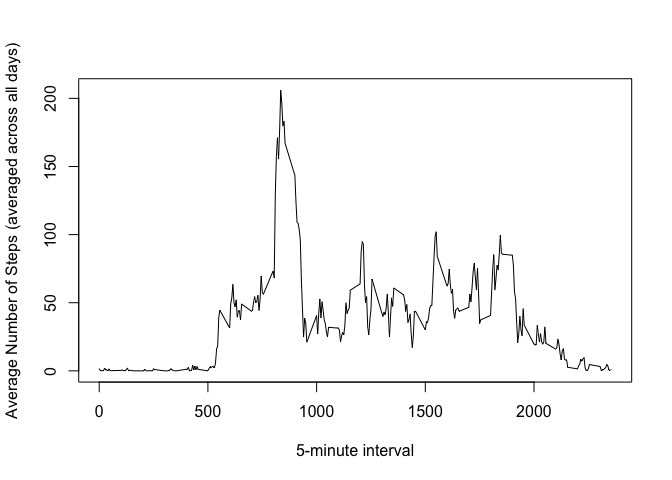

# Reproducible Research: Peer Assessment 1


## Loading and preprocessing the data
1. Load activity.csv using read.csv()
2. Separate complete and incomplete data. They will both be used in subsequent analysis.

```r
unzip("activity.zip")
activityDF <- read.csv("activity.csv")

completeActivityDF <- activityDF[complete.cases(activityDF),]
incompleteActivityDF <- activityDF[!complete.cases(activityDF),]

unlink("activity.csv")
```


## What is mean total number of steps taken per day?
1. Make a histogram of the total number of steps taken each day

```r
# Set tidy dataset

completeActivityDF1 <- completeActivityDF %>% 
  #select steps, date
  select(steps,date) %>% 
  # Group by subject and activity name
  group_by(date) %>% 
  # Get the sum of each variables
  summarise_each(funs(sum)) 

#1. Make a histogram of the total number of steps taken each day
hist(as.numeric(completeActivityDF1$steps),main="", col="red",xlab="Average Number of Steps per Day")
```

 
2. Calculate and report the mean and median total number of steps taken per day

```r
medianVal <- median(completeActivityDF1$steps)
print(medianVal)
```

```
## [1] 10765
```

```r
meanVal <- mean(completeActivityDF1$steps)
print(meanVal)
```

```
## [1] 10766.19
```

## What is the average daily activity pattern?

```r
completeActivityDF2 <- completeActivityDF %>% 
  #select steps, date
  select(steps,interval) %>% 
  # Group by subject and activity name
  group_by(interval) %>% 
  # Get the mean of each variables
  summarise_each(funs(mean)) %>% 
  # Sort result by subject and activity name
  arrange(interval)

plot(completeActivityDF2$interval,as.numeric(completeActivityDF2$steps),type="l", col="black", xlab="",ylab="Average Number of Steps")
```

 

```r
#interval with max ave steps

intervalWithMaxStep <- filter(completeActivityDF2,steps == max(completeActivityDF2$steps))
print (intervalWithMaxStep)
```

```
## Source: local data frame [1 x 2]
## 
##   interval    steps
##      (int)    (dbl)
## 1      835 206.1698
```


## Imputing missing values

```r
imputedActivityDF <- merge(incompleteActivityDF,completeActivityDF2,by.x = "interval",by.y="interval", all.x = TRUE)

imputedActivityDF <- select(imputedActivityDF,steps.y,date,interval)
names(imputedActivityDF) <- c("steps","date","interval")
combinedCompleteActivityDF <- rbind(completeActivityDF, imputedActivityDF)

# Set tidy dataset
combinedDF <- combinedCompleteActivityDF %>% 
  #select steps, date
  select(steps,date) %>% 
  # Group by subject and activity name
  group_by(date) %>% 
  # Get the mean of each variables
  summarise_each(funs(sum)) %>% 
  # Sort result by subject and activity name
  arrange(date)

hist(as.numeric(combinedDF$steps),main="", col="red",xlab="Average Number of Steps per Day")
```

 
2. Calculate and report the mean and median total number of steps taken per day

```r
medianVal <-median(combinedDF$steps)
print(medianVal)
```

```
## [1] 10766.19
```

```r
meanVal <-mean(combinedDF$steps)
print(meanVal)
```

```
## [1] 10766.19
```


## Are there differences in activity patterns between weekdays and weekends?

```r
weekendDF <- filter(combinedCompleteActivityDF, wday(date) == 1 | wday(date) == 7)


# Set tidy dataset
weekendDF2 <- weekendDF %>% 
  #select steps, date
  select(steps,interval) %>% 
  # Group by subject and activity name
  group_by(interval) %>% 
  # Get the mean of each variables
  summarise_each(funs(mean)) %>% 
  # Sort result by subject and activity name
  arrange(interval)

weekendDF2$day <- "weekend"
#plot(weekendDF2$interval,as.numeric(weekendDF2$steps),type="l", col="black", xlab="weekends",ylab="average number of steps taken")


weekdaysDF <- filter(combinedCompleteActivityDF, wday(date) != 1 & wday(date) != 7)


# Set tidy dataset
weekdaysDF2 <- weekdaysDF %>% 
  #select steps, interval
  select(steps,interval) %>% 
  # Group by interval
  group_by(interval) %>% 
  # Get the mean 
  summarise_each(funs(mean)) %>% 
  # Sort result by interval
  arrange(interval)

weekdaysDF2$day <- "weekday"

#plot(weekdaysDF2$interval,as.numeric(weekdaysDF2$steps),type="l", col="blue", xlab="weekdays",ylab="")
combinedNew <- rbind(weekendDF2,weekdaysDF2)

sp <- ggplot(combinedNew, aes(x=combinedNew$interval, y=combinedNew$step)) + geom_line()
sp + facet_grid(day ~ .)
```

 


